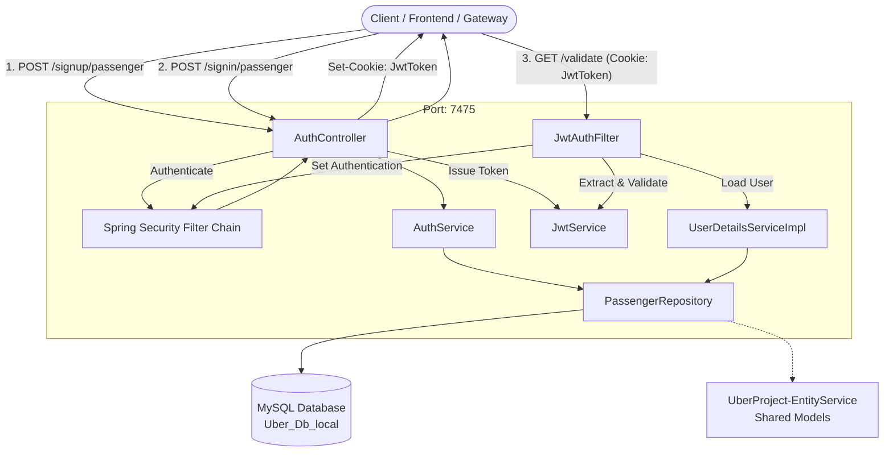

# 🚗 UberProject - Authentication Service (AuthService)

[](https://www.oracle.com/java/)
[](https://spring.io/projects/spring-boot)
[](https://spring.io/projects/spring-security)
[](https://gradle.org)
[](https://www.mysql.com/)

**UberProject-AuthService** is the dedicated authentication and authorization microservice in the Uber backend ecosystem. It handles secure user registration, credential authentication, JWT token generation, cookie-based session management, and request authentication validation for passengers and drivers.

---

## 📑 Table of Contents

- [Architecture Overview](#-architecture-overview)
- [Key Features](#-key-features)
- [Tech Stack & Dependencies](#-tech-stack--dependencies)
- [Project Structure](#-project-structure)
- [API Endpoints](#-api-endpoints)
  - [1. Passenger Sign Up](#1-passenger-sign-up)
  - [2. Passenger Sign In](#2-passenger-sign-in)
  - [3. Validate Authentication Token](#3-validate-authentication-token)
- [Authentication Flow](#-authentication-flow)
- [Configuration & Environment Variables](#-configuration--environment-variables)
- [Prerequisites](#-prerequisites)
- [Getting Started & Running Locally](#-getting-started--running-locally)
- [Database Setup](#-database-setup)
- [Testing the API](#-testing-the-api)
- [Related Repositories](#-related-repositories)

---

## 🏗 Architecture Overview



---

## ✨ Key Features

- **Passenger Sign Up**: Secure passenger registration with hashed password persistence (`BCrypt`).
- **Stateless JWT Authentication**: Generates signed HMAC-SHA JSON Web Tokens (using JJWT `0.13.0`).
- **Secure Cookie Management**: Issues HTTP-Only authentication cookies (`JwtToken`) preventing XSS token theft.
- **Spring Security Integration**:
  - Custom `OncePerRequestFilter` (`JwtAuthFilter`) for cookie-based JWT parsing and `SecurityContextHolder` authentication injection.
  - Custom `UserDetailsService` and `DaoAuthenticationProvider` for credential verification.
  - Path-based security rules permitting public authentication routes and enforcing token validation on secured endpoints.
- **CORS Configuration**: Configured with credentials support for seamless cross-origin web client integration.
- **Shared Entity Service**: Built against common domain models from `UberProject-EntityService`.

---

## 🛠 Tech Stack & Dependencies

- **Java**: 21
- **Framework**: Spring Boot 4.0.1
- **Security**: Spring Security (BCrypt, DaoAuthenticationProvider)
- **Token Management**: JJWT (`io.jsonwebtoken:jjwt:0.13.0`)
- **Persistence**: Spring Data JPA / Hibernate
- **Database**: MySQL (Connector `com.mysql:mysql-connector-j`)
- **Database Migration**: Flyway
- **Boilerplate Reduction**: Project Lombok
- **Build Tool**: Gradle

---

## 📂 Project Structure

```
UberProject-AuthService/
├── src/
│   ├── main/
│   │   ├── java/com/example/uberprojectauthservice/
│   │   │   ├── configurations/
│   │   │   │   └── SpringSecurity.java         # SecurityFilterChain, PasswordEncoder, CORS config
│   │   │   ├── controllers/
│   │   │   │   └── AuthController.java         # REST endpoints for sign-up, sign-in, and validate
│   │   │   ├── dto/
│   │   │   │   ├── AuthRequestDto.java         # Request payload for sign-in (email, password)
│   │   │   │   ├── AuthResponseDto.java        # Response payload for sign-in ({ success: true })
│   │   │   │   ├── PassengerDto.java           # Response payload for passenger details
│   │   │   │   └── PassengerSignUpRequestDto.java # Request payload for passenger registration
│   │   │   ├── filters/
│   │   │   │   └── JwtAuthFilter.java          # JWT cookie extractor and SecurityContext authenticator
│   │   │   ├── helpers/
│   │   │   │   └── AuthPassengerDetails.java   # Spring Security UserDetails adapter for Passenger
│   │   │   ├── repositories/
│   │   │   │   ├── DriverRepository.java       # Driver JPA repository
│   │   │   │   └── PassengerRepository.java    # Passenger JPA repository (find by email)
│   │   │   ├── services/
│   │   │   │   ├── AuthService.java            # Registration business logic & password hashing
│   │   │   │   ├── JwtService.java             # JWT generation, signing, claims parsing & validation
│   │   │   │   └── UserDetailsServiceImpl.java # Custom UserDetailsService loading passenger by email
│   │   │   └── UberProjectAuthServiceApplication.java # Spring Boot entry point & JPA Auditing config
│   │   └── resources/
│   │       ├── application.properties          # Database, server port, JWT secret & expiry configs
│   │       └── db/                             # Database migration scripts
│   └── test/
│       └── java/com/example/uberprojectauthservice/
│           └── UberProjectAuthServiceApplicationTests.java
├── build.gradle                                # Gradle build definitions & dependencies
├── settings.gradle                             # Gradle settings
├── gradlew / gradlew.bat                       # Gradle wrappers
└── README.md
```

---

## 📡 API Endpoints

**Base URL**: `http://localhost:7475`

### 1. Passenger Sign Up
Registers a new passenger account.

- **URL**: `/api/v1/auth/signup/passenger`
- **Method**: `POST`
- **Authentication Required**: `No`
- **Content-Type**: `application/json`

#### Request Body
```json
{
  "name": "John Doe",
  "email": "john.doe@example.com",
  "password": "Password@123",
  "phoneNumber": "+1234567890"
}
```

#### Response (`201 CREATED`)
```json
{
  "id": "1",
  "name": "John Doe",
  "email": "john.doe@example.com",
  "password": "$2a$10$e8w...",
  "phoneNumber": "+1234567890",
  "createdAt": "2026-08-31T15:30:00.000+00:00"
}
```

---

### 2. Passenger Sign In
Authenticates passenger credentials and sets an `HttpOnly` JWT cookie in the response header.

- **URL**: `/api/v1/auth/signin/passenger`
- **Method**: `POST`
- **Authentication Required**: `No`
- **Content-Type**: `application/json`

#### Request Body
```json
{
  "email": "john.doe@example.com",
  "password": "Password@123"
}
```

#### Response Headers
```http
Set-Cookie: JwtToken=<generated_jwt_token>; Path=/; Max-Age=3600; HttpOnly
```

#### Response Body (`200 OK`)
```json
{
  "success": true
}
```

---

### 3. Validate Authentication Token
Validates the presence and authenticity of the JWT cookie.

- **URL**: `/api/v1/auth/validate`
- **Method**: `GET`
- **Authentication Required**: `Yes` (via `JwtToken` cookie)

#### Request Headers
```http
Cookie: JwtToken=<jwt_token>
```

#### Response (`200 OK`)
```text
Success
```

#### Error Response (`403 FORBIDDEN` / `401 UNAUTHORIZED`)
Returned if the token is missing, invalid, or expired.

---

## 🔐 Authentication Flow

```
+--------+                 +--------------------+                 +---------------+
| Client |                 |    AuthController  |                 |  Jwt/Security |
+--------+                 +--------------------+                 +---------------+
    |                                |                                    |
    | 1. POST /signin/passenger      |                                    |
    |------------------------------->|                                    |
    |                                | 2. authenticate(email, password)   |
    |                                |----------------------------------->|
    |                                | 3. Authentication success          |
    |                                |<-----------------------------------|
    |                                | 4. createToken(email)              |
    |                                |----------------------------------->|
    |                                | 5. Return JWT string               |
    |                                |<-----------------------------------|
    | 6. Set-Cookie: JwtToken=...    |                                    |
    |    { success: true }           |                                    |
    |<-------------------------------|                                    |
    |                                                                     |
    |                                                                     |
    | 7. GET /validate [Cookie: JwtToken]                                 |
    |-------------------------------------------------------------------->|
    |                                             [JwtAuthFilter]         |
    |                                             - Extracts token        |
    |                                             - Validates signature   |
    |                                             - Sets SecurityContext  |
    | 8. 200 OK ("Success")                                               |
    |<--------------------------------------------------------------------|
```

---

## ⚙ Configuration & Environment Variables

Key properties are configured in [`src/main/resources/application.properties`](file:///d:/IdeaProjects/UberProject-AuthService/src/main/resources/application.properties):

| Property | Default Value | Description |
| :--- | :--- | :--- |
| `server.port` | `7475` | Port on which the service runs |
| `spring.datasource.url` | `jdbc:mysql://localhost:3306/Uber_Db_local` | MySQL JDBC connection string |
| `spring.datasource.username` | `root` | Database username |
| `spring.datasource.password` | `Mukul@142005` | Database password |
| `spring.jpa.hibernate.ddl-auto` | `validate` | Hibernate DDL validation mode |
| `spring.jpa.show-sql` | `true` | Log executed SQL statements |
| `jwt.expiry` | `3600` | JWT expiration duration (in seconds) |
| `cookie.expiry` | `3600` | Cookie Max-Age duration (in seconds) |
| `jwt.secret` | *(configured secret key)* | HMAC-SHA secret key for JWT signing |

> [!IMPORTANT]
> In production environments, replace database credentials and `jwt.secret` with secure environment variables or a secret management service.

---

## 📋 Prerequisites

- **Java 21** or later (JDK 21)
- **MySQL 8.0+** running locally or remotely
- **Gradle 8+** (or use the included `./gradlew` wrapper)
- **UberProject-EntityService** (installed to local Maven cache: `mavenLocal()` as version `0.0.9-SNAPSHOT`)

---

## 🚀 Getting Started & Running Locally

### 1. Clone the repository
```bash
git clone https://github.com/MukulVerma14/UberProject-AuthService.git
cd UberProject-AuthService
```

### 2. Publish Entity Service locally (if required)
Ensure `UberProject-EntityService` is compiled and published to your local Maven repository:
```bash
# In the UberProject-EntityService directory:
./gradlew publishToMavenLocal
```

### 3. Setup MySQL Database
Create the database in MySQL:
```sql
CREATE DATABASE Uber_Db_local;
```

### 4. Build the Application
```bash
# On Linux / macOS:
./gradlew clean build

# On Windows (PowerShell / Command Prompt):
.\gradlew.bat clean build
```

### 5. Run the Service
```bash
# Using Gradle:
./gradlew bootRun

# Or run the packaged JAR:
java -jar build/libs/UberProject-AuthService-0.0.1-SNAPSHOT.jar
```

The service will start on port **`7475`**.

---

## 🧪 Testing the API

### Using cURL

**1. Sign Up a Passenger:**
```bash
curl -X POST http://localhost:7475/api/v1/auth/signup/passenger \
  -H "Content-Type: application/json" \
  -d '{
    "name": "Alice Smith",
    "email": "alice@example.com",
    "password": "Password123!",
    "phoneNumber": "+1987654321"
  }'
```

**2. Sign In (Save Cookie to file `cookies.txt`):**
```bash
curl -X POST http://localhost:7475/api/v1/auth/signin/passenger \
  -H "Content-Type: application/json" \
  -c cookies.txt \
  -d '{
    "email": "alice@example.com",
    "password": "Password123!"
  }'
```

**3. Validate Session using Saved Cookie:**
```bash
curl -X GET http://localhost:7475/api/v1/auth/validate \
  -b cookies.txt
```

---

## 🔗 Related Repositories

- **`UberProject-EntityService`**: Common domain entities, JPA mappings, and base audit entities.
- **`UberProject-BookingService`**: Ride booking and passenger-driver matching.
- **`UberProject-LocationService`**: Driver geo-tracking and proximity queries.

---

## 📄 License

This project is part of the Uber microservices backend architecture.
